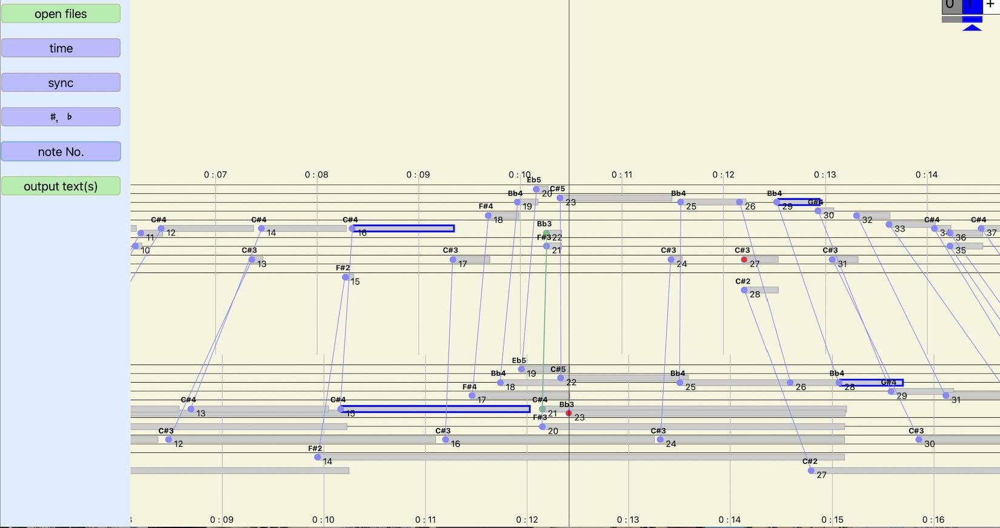

# MIDI2MIDI

同一楽曲の異なる2つの演奏MIDIデータをアライメント（自動同期）し、一方のMIDI上で定義した任意の音符情報を、他方のMIDIから一対一で正確に検出・紐付けするシステムです。

複数パターンの演奏MIDIを対象に、各小節のダウンビート（冒頭音）や特定の伴奏パターンのオンセットタイミングを抽出・比較する際、従来は手作業による膨大な反復処理が課題となっていました。

本システムは、1つの基準MIDIデータに対して行ったアノテーション（ラベル付けや音の指定）を、アライメント技術によって他の演奏MIDIへ自動的に一括反映します。これにより、データ作成における単純な反復作業を完全に排除し、効率的かつ精密な演奏行動の比較分析を可能にします。

---

## System Overview

  

---

## Resources & Downloads

| Target | Content | Link |
| :--- | :--- | :--- |
| 📖 **Manual** | Online Documentation & Specification | [Online Manual](manual.html) |
| 🍏 **For Mac** | Package for macOS Environment | [Mac documentation (zip)](mac.zip) |
| 🪟 **For Windows** | Package for Windows Environment | [Windows documentation (exe)](into.exe) |

---

